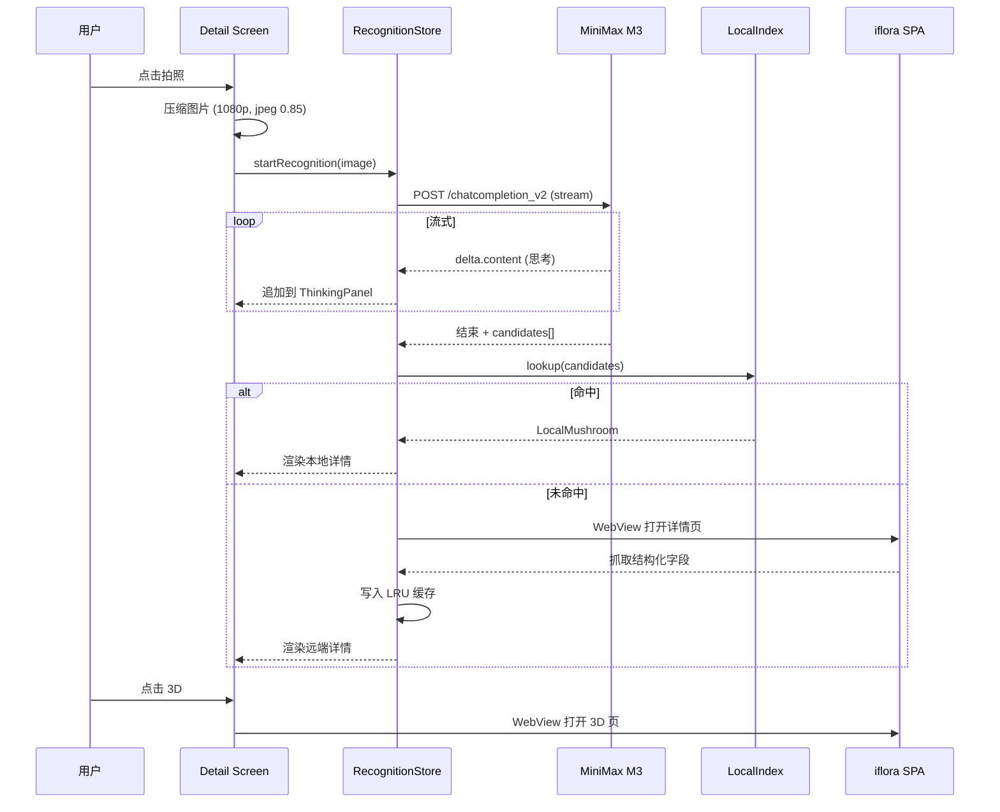

# Mushroom 蘑菇识别 App — 详细设计逻辑

> 原始需求：拍照 → 大模型流式识别 → 本地检索 → 远端拉取详情 → 渲染 → 3D 查看
>
> 本文档在该需求基础上补充完整的业务逻辑、状态流转、异常处理、性能与安全设计。

---

## 0. 原始需求（基线）

1. 用户进入主界面后，能够直接点击拍照按钮进行拍照（拍照按钮要很明显，用户单手可直接触达）
2. 用户拍照后，调用大模型接口进行识别，流式返回思考过程（中文），思考过程支持折叠，但是默认展开，并且最终以 list 形式返回可能的蘑菇名称
3. 收到结果后，从本地检索蘑菇信息，检索到后，获取远端地址，将信息拉取到本地渲染出来（参考： https://fungi.iflora.cn/#/speciesDetail/9508/Gymnopus%20densilamellatus/list?type=general_directory&page=5 ）；并且将蘑菇信息渲染出来供用户判断；用户点击查看更加详细的三维信息时，调用 https://mushroom.iflora.cn/?search={key_work} 将蘑菇的三维信息调出来供用户进一步查看
4. 大模型请求接口 MiniMax-M3 (API手册： https://platform.minimaxi.com/docs/api-reference/text-chat-openai)

---

## 1. 设计目标 & 核心价值

| 维度 | 目标 |
|------|------|
| 核心价值 | "拍一拍就能认识蘑菇"，降低真菌识别的门槛 |
| 信任优先 | 不可"假装权威" — 必须展示思考过程 + 候选 list + 来源链接，把判断权留给用户 |
| 可信参考 | 远端数据源为 [fungi.iflora.cn](https://fungi.iflora.cn) 与 [mushroom.iflora.cn](https://mushroom.iflora.cn)，属于学术性真菌数据库 |
| 风险提示 | 蘑菇识别涉及食品安全，必须明确提示"不可作为食用依据" |

> **非目标**：本期不实现离线识别模型、不实现自建蘑菇数据库、不做用户账号体系。

---

## 2. 用户场景与完整流程

### 2.1 主链路（Happy Path）

```
┌────────┐    ┌────────┐    ┌─────────┐    ┌────────┐    ┌────────┐    ┌────────┐
│ 主页    │ →  │ 拍照    │ →  │ AI 识别  │ →  │ 本地检索 │ →  │ 远端拉取 │ →  │ 详情渲染 │ → 3D
│ (按钮)  │    │ (单手)  │    │ (流式)  │    │ (缓存)  │    │ (详情)  │    │ (List)  │
└────────┘    └────────┘    └─────────┘    └────────┘    └────────┘    └────────┘
```

### 2.2 状态机（核心 UI）

| 状态 | 触发 | UI 表现 | 允许操作 |
|------|------|---------|----------|
| `IDLE` | App 启动 / 用户重置 | 大尺寸拍照按钮居中 | 拍照、查看历史 |
| `CAPTURING` | 点击拍照 | 系统相机全屏 | 取消、确认 |
| `UPLOADING` | 拍摄完成 | 全屏 loading + "正在上传图片" | 无 |
| `RECOGNIZING` | 收到第一个 token | 顶部流式思考区（可折叠）+ 底部 loading | 折叠/展开思考、取消 |
| `RECOGNIZED` | 流式结束 | 候选蘑菇 list | 点选查看详情、重新拍照 |
| `LOCAL_HIT` | 命中本地 | 详情页（本地数据） | 查看 3D、重新拍照 |
| `LOCAL_MISS` | 未命中本地 | loading "正在拉取云端详情" | 取消 |
| `RENDERED` | 拉取完成 | 详情页（云端数据） | 查看 3D、重新拍照 |
| `ERROR` | 任意失败 | Toast + 重试按钮 | 重试、返回 |

### 2.3 异常分支

| 异常 | 检测点 | 用户感知 | 兜底 |
|------|--------|----------|------|
| 相机权限被拒 | 启动拍照 | 弹窗引导去系统设置 | 提供"从相册选择" |
| 图片上传超时 | 30s 未收到首个 token | Toast "网络较差，正在重试" | 自动重试 1 次 |
| 大模型返回空 list | 流式结束但 `candidates=[]` | 详情区提示"未能识别，建议人工确认" | 引导到 iflora.cn 全站搜索 |
| 本地 & 远端都查不到 | 两次检索都 404 | "暂未收录该蘑菇，建议谨慎处理" | 禁用 3D 按钮 |
| 3D 加载失败 | webview 错误 | 详情页降级为文本描述 | 隐藏 3D 入口 |

---

## 3. 核心逻辑详解

### 3.1 拍照模块

**入口位置**：主页底部居中，半径约屏幕宽度 18%，距底部 32pt。
**可达性**：
- 单手操作：按钮中心点位于屏幕底部拇指自然弧线（iPhone 14 约 y=屏幕高×85%）
- 支持手势：上滑按钮进入"从相册选"（降低首次拍照恐惧）

**图片预处理**：
- 压缩到 `max 1080px` 长边，JPEG quality 0.85（节省 token 与流量）
- EXIF 方向修正
- **不上传原图**，避免大模型 token 爆炸

**权限处理**：
- 首次进入时申请相机权限
- 被拒后：弹窗 + 「去设置」+ 「从相册选」两个 CTA

### 3.2 AI 识别（MiniMax M3 流式调用）

**Endpoint**：`https://api.minimaxi.com/v1/text/chatcompletion_v2`
**Model**：`MiniMax-M3`（按官方文档）
**Mode**：`stream=true`

**请求体关键字段**：
```json
{
  "model": "MiniMax-M3",
  "stream": true,
  "temperature": 0.2,
  "messages": [
    {
      "role": "system",
      "content": "你是一名真菌学专家。请用中文逐步分析用户上传的蘑菇图片特征（菌盖、菌褶、菌柄、菌环、菌托、生境），先输出思考过程，最后用 JSON 数组给出 3 个最可能的候选学名（拉丁名）。注意：不可作为食用建议。"
    },
    {
      "role": "user",
      "content": [
        {"type": "text", "text": "请识别这张图片中的蘑菇。"},
        {"type": "image_url", "image_url": {"url": "<base64 或 oss url>"}}
      ]
    }
  ]
}
```

**流式响应解析**：
- 每个 chunk 是 SSE 格式 `data: {...}\n\n`
- 解析 `delta.content`，按以下规则分发：
  - 内容以 `{` 结尾 → 视为「思考过程」，**追加到「思考区」UI**
  - 内容是合法 JSON 数组 → 视为「最终候选」，**停止追加到思考区**，解析为 `Candidate[]`
  - 内容以 `[...]` 包裹且解析失败 → 回退到正则提取 `["xxx", "yyy"]`

**思考区交互**：
- 默认展开（`expanded = true`）
- 右上角折叠按钮 / 点击标题栏可折叠
- 折叠时显示"已隐藏思考过程"

**候选数据模型**：
```ts
interface Candidate {
  scientificName: string;  // 拉丁名 "Gymnopus densilamellatus"
  commonName?: string;     // 中文俗名（可选）
  confidence?: number;     // 0-1（若模型给出）
  reason?: string;         // 简短判断理由
}
type RecognitionResult = {
  thinking: string;        // 完整思考过程
  candidates: Candidate[]; // 1~N 个
};
```

### 3.3 本地检索

**本地数据结构**（`assets/mushroom_index.json` 或 KV/DB）：
```ts
interface LocalMushroom {
  scientificName: string;        // 唯一键（拉丁名）
  commonName?: string;
  shortDesc: string;             // 1~2 句简介（用于详情首屏）
  detailRemotePath: string;      // iflora 详情路径模板
  previewImages: string[];       // 本地缩略图资源
  has3D: boolean;                // 是否支持 3D
  cachedDetailJson?: string;     // 上次拉取的 JSON 缓存（按 LRU 50 条）
}
```

**匹配策略**：
1. 精确匹配 `scientificName`（case-insensitive，去除前后空格）
2. 若失败，去除属/种加词变异（如 `sp.`、`cf.`、`aff.`）再匹配
3. 若失败，取候选 list 的前 3 个，按「任一命中」即视为本地命中（用第一个命中的）

**性能预算**：
- 索引 ≤ 5000 条 → JSON 一次性加载 + 内存 map 即可
- > 5000 条 → 用 SQLite FTS5

### 3.4 远端详情拉取

**远端 URL 模板**：
```
https://fungi.iflora.cn/#/speciesDetail/{ID}/{URL_ENCODED_NAME}/list?type=general_directory&page=5
```

> **注意**：远端是 SPA，HTML 实际不包含数据。需要通过其背后的 API（如 `/api/...`）直接拉 JSON，或用「WebView + 注入脚本抓 DOM」方式。**本期推荐方案 B（WebView 嵌入 SPA）**，避免反向工程 API。

**拉取策略**：
- 若本地有 `cachedDetailJson` 且 `age < 7d` → 直接用
- 否则打开 SPA WebView，等待 `document.querySelector('.species-detail')` 出现后再 `evaluateJavaScript` 提取结构化字段，存为缓存
- 失败时降级：仅展示 `shortDesc` + 跳转官方链接按钮

**最终渲染字段**（参考 iflora 详情页）：
- 中文名 / 学名 / 分类地位
- 形态描述（菌盖、菌褶、菌柄、孢子印）
- 生境与分布
- 毒性/食用性（**显著标红，并加 ⚠️ 提示**）
- 图集（轮播）
- 「查看 3D 模型」按钮

### 3.5 3D 查看

**入口**：详情页右上角 / 底部主按钮，文案"查看 3D 模型"。
**加载方式**：
- 内嵌 WebView 打开 `https://mushroom.iflora.cn/?search={urlencoded(scientificName)}`
- WebView 配置：
  - `javaScriptEnabled=true`
  - `domStorageEnabled=true`
  - `mediaPlaybackRequiresUserAction=false`
  - 允许跨域（远端用了 CDN）
- 顶部条提供「关闭」与「在浏览器中打开」

**降级**：
- WebView 加载失败 → Toast "3D 暂不可用"+ 自动隐藏按钮
- 3D 资源未命中 → 远端页面会显示空状态，本地不做额外处理

---

## 4. 架构与数据流

### 4.1 分层

```
┌─────────────────────────────────────────┐
│  UI Layer (Compose / SwiftUI / RN)      │
│  - CameraScreen                         │
│  - RecognitionScreen (含 ThinkingPanel) │
│  - DetailScreen                         │
│  - ThreeDViewerScreen                   │
└────────────┬────────────────────────────┘
             │
┌────────────▼────────────────────────────┐
│  ViewModel / Store                      │
│  - RecognitionStore                     │
│  - MushroomRepository                   │
│  - ApiClient (MiniMax M3)               │
└────────────┬────────────────────────────┘
             │
┌────────────▼────────────────────────────┐
│  Data Layer                             │
│  - LocalIndex (JSON / SQLite)           │
│  - DetailCache (LRU 50, 7d TTL)         │
│  - RemoteDetail (WebView bridge)        │
└─────────────────────────────────────────┘
```

### 4.2 关键调用序列



### 4.3 缓存策略

| 缓存 | 触发 | 容量 | TTL | 失效 |
|------|------|------|-----|------|
| 识别结果思考过程 | 流式结束 | 内存 | 单次会话 | 退出 App |
| 本地索引 | App 启动 | 内存 | 永久 | App 升级 |
| 远端详情 JSON | 拉取成功 | LRU 50 条 | 7 天 | TTL 过期 / 手动刷新 |
| 缩略图 | 详情渲染 | 系统图库 | 永久 | 清理缓存 |

---

## 5. 错误处理矩阵

| 错误码/现象 | 触发条件 | 用户提示 | 自动重试 | 兜底 |
|-------------|----------|----------|----------|------|
| 相机无权限 | 系统拦截 | 引导设置 | ❌ | 提示从相册选择 |
| 上传失败 (网络) | HTTP 5xx / timeout | "网络异常" | ✅ ×1 | 退出识别 |
| 流式中断 | SSE 提前断开 | 完整渲染已有内容 + Toast | ❌ | 候选为空时提示重试 |
| 候选为空 | 模型未识别 | "暂未识别" | ❌ | 引导官方检索 |
| 本地未命中 | lookup miss | 静默转远端 | — | — |
| 远端 404 | SPA 显示空 | "暂未收录" | ❌ | 禁用 3D |
| 远端超时 | 8s 未拿到首屏 | "网络较慢" | ✅ ×1 | 降级到 shortDesc |
| 3D 加载失败 | WebView error | Toast + 隐藏按钮 | ❌ | 提供官方链接 |

---

## 6. UI/UX 规范

### 6.1 配色与警示
- **主色**：深森林绿 `#2E5E3A`
- **警示色**：毒红 `#C0392B`（用于毒性、不可食用字段）
- **思考区背景**：浅米色 `#F7F3E8`，让"思考"与"结果"在视觉上分离

### 6.2 关键页面
1. **主页 (Home)**
   - 顶部 App 标题 + 历史按钮
   - 中部空状态插画（"发现身边的蘑菇"）
   - 底部大圆形拍照按钮（FAB）
2. **识别页 (Recognizing)**
   - 顶部 9:16 缩略图（用户拍的蘑菇）
   - 思考区（可折叠，默认展开）：打字机效果 + 骨架
   - 底部候选 list 加载占位
3. **详情页 (Detail)**
   - 顶部大图轮播
   - 中部结构化字段
   - 底部固定栏：左侧「重新拍照」，右侧「查看 3D」
4. **3D 页**
   - 顶部关闭按钮
   - 全屏 WebView
   - 右下角悬浮"在浏览器中打开"

### 6.3 文案
- 识别中：避免"AI 正在识别"等抽象表达，使用"正在分析蘑菇特征…"
- 警示：固定文案 **"⚠️ 识别结果仅供参考，切勿仅凭此判断食用安全性"** 出现在详情页顶部

---

## 7. 性能预算

| 指标 | 目标 |
|------|------|
| 冷启动到主页可点击 | ≤ 1.5s |
| 拍照到首个流式 token | ≤ 3s（4G） |
| 流式思考到候选完成 | ≤ 8s |
| 本地命中详情渲染 | ≤ 200ms |
| 远端详情拉取到首屏 | ≤ 4s |
| 3D 打开到模型可见 | ≤ 5s |

---

## 8. 安全 & 合规

> ⚠️ **【安全警示】原始需求文档中明文暴露了 `APIKEY` (`sk-cp-Na-…`)。**
> 任何人读到这份文档都能滥用该 key 并产生费用。**必须**：
> 1. **立即在 MiniMax 控制台轮换（revoke + 重新签发）该 key**
> 2. 在 App / 后端通过环境变量 / 密钥管理服务注入，**禁止硬编码**
> 3. 清理所有 git 历史中的明文痕迹
> 4. 本文档与代码中的 key 用 `sk-cp-***REDACTED***` 占位

### 8.1 其它安全要点
- 客户端不存储任何用户上传图片（识别后立即释放）
- 远端 API 调用走服务端代理（避免 key 下发到客户端）
- 用户图片走 HTTPS，禁明文
- 隐私政策：声明"图片仅用于本次识别，不做留存"
- 食品安全免责：详情页与启动页均显示"不可作为食用依据"提示

---

## 9. 可测试性

### 9.1 单元测试（覆盖率目标 ≥ 80%）
- 流式响应解析器：合法/非法/截断/嵌套 JSON
- 本地匹配：精确 / 大小写 / 变体（sp./cf.）
- 候选排序
- 缓存 LRU 淘汰

### 9.2 集成测试
- Mock MiniMax M3：返回固定流式片段
- Mock LocalIndex：注入若干 LocalMushroom
- 端到端：拍照 → 识别 → 命中本地 → 渲染

### 9.3 E2E（关键路径）
- 路径 A：拍照 → 命中本地 → 渲染 → 进 3D
- 路径 B：拍照 → 未命中 → 远端拉取 → 渲染
- 路径 C：拍照 → 候选为空 → 错误页
- 路径 D：网络断开 → 错误页 + 重试

---

## 10. 待办 / 后续迭代

| 优先级 | 项目 | 备注 |
|--------|------|------|
| P0 | **轮换并迁移 API key** | 见 §8 |
| P0 | 食品安全免责条款接入法务审核 | 详情页 + 启动页 |
| P1 | 候选置信度展示 | 模型若能给概率则更可信 |
| P1 | 多语言（英文） | 留学生 / 海外华人 |
| P1 | 历史记录本地持久化 | 让用户可回看 |
| P2 | 离线打包常见蘑菇库 | 流量差场景 |
| P2 | 用户反馈"识别错了" → 收集样本 | 后续可微调 |
| P3 | AR 叠加（将学名直接浮在画面上） | 趣味性 |

---

## 11. 参考资料

- MiniMax M3 API: https://platform.minimaxi.com/docs/api-reference/text-chat-openai
- iflora 详情参考: https://fungi.iflora.cn/#/speciesDetail/9508/Gymnopus%20densilamellatus/list?type=general_directory&page=5
- 3D 平台: https://mushroom.iflora.cn/?search={keyword}

---

## 12. 变更记录

| 日期         | 版本   | 变更                      | 作者       |
| ---------- | ---- | ----------------------- | -------- |
| 2026-06-12 | v0.1 | 原始 4 条需求                | —        |
| 2026-06-12 | v0.2 | 补充完整业务逻辑、状态机、缓存、安全与测试策略 | Claudian |
